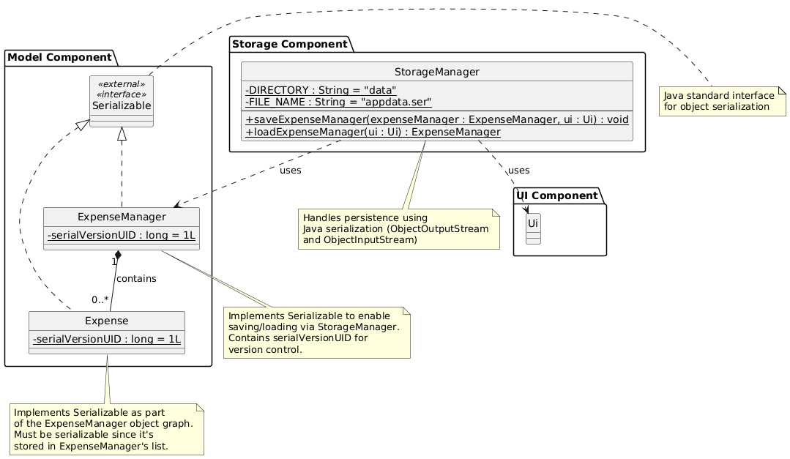
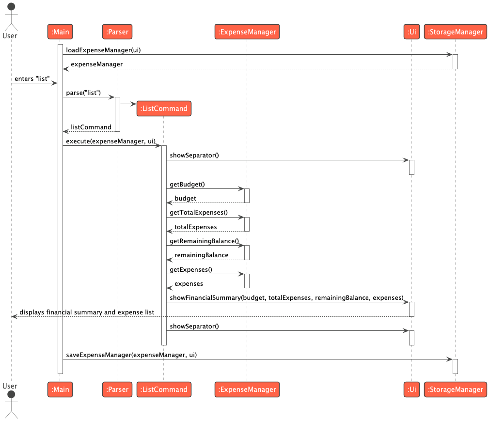
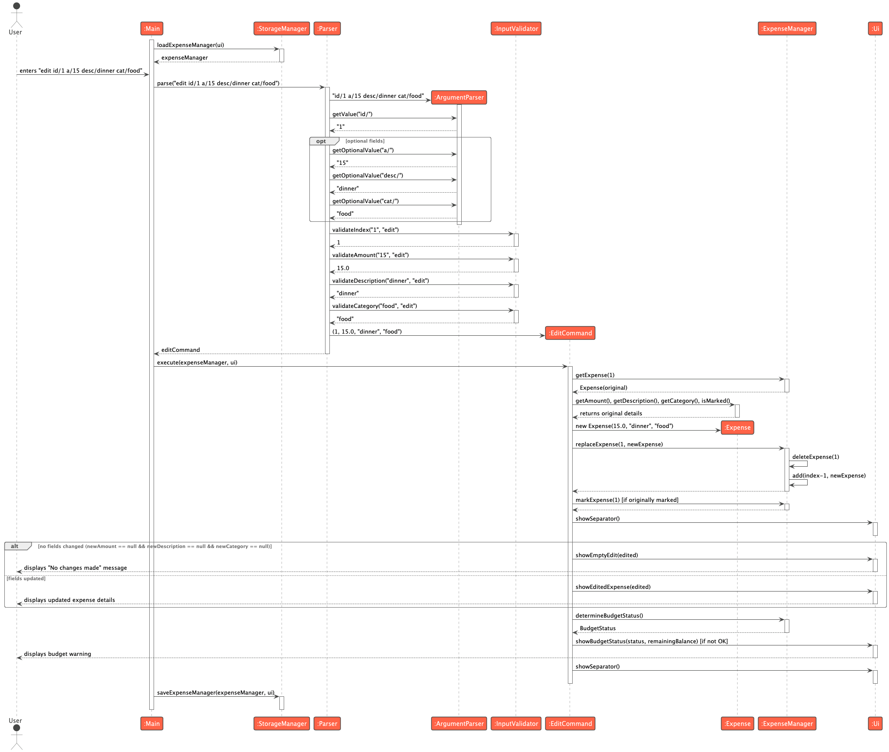
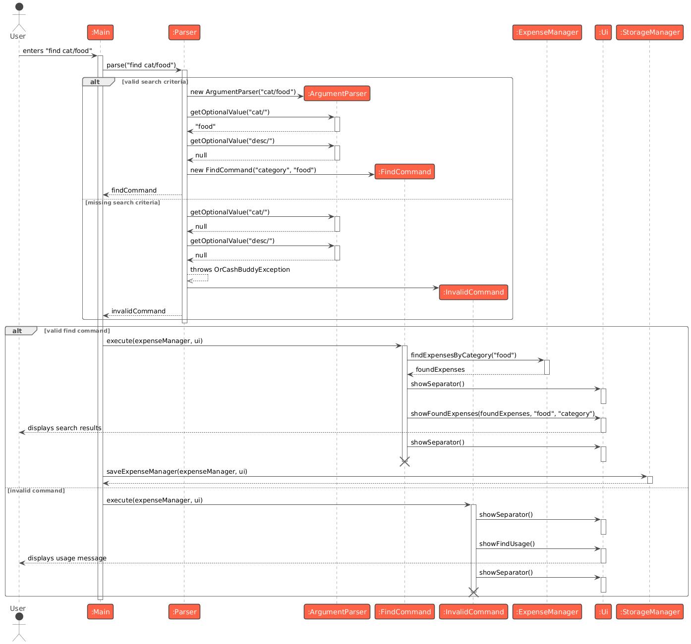
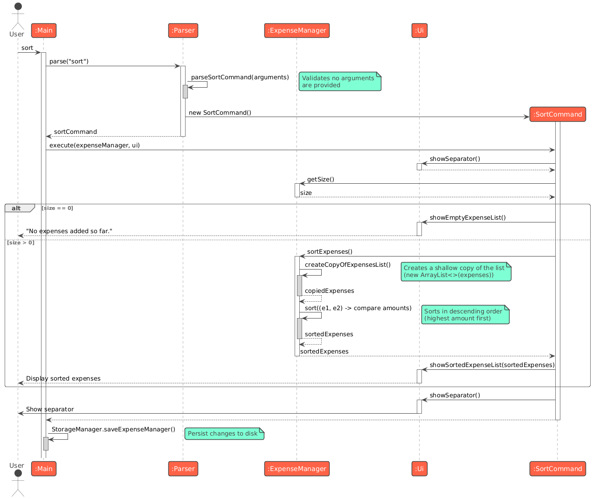
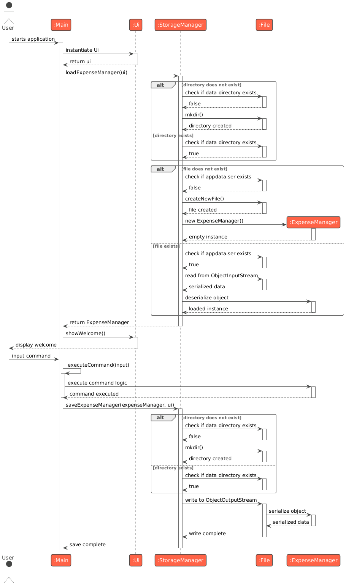

# Developer Guide

This Developer Guide (DG) introduces the internals of **orCASHbuddy**, outlines design decisions, and documents how to extend, test, and deploy the project. It is written for developers who will maintain or enhance the application.

---

## Acknowledgements

- Command pattern architecture, testing strategy, and documentation structure were adapted from the [AddressBook-Level3](https://se-education.org/addressbook-level3/) (AB3) teaching codebase.
- orCASHbuddy was bootstrapped from the CS2113 template project.

---

## Table of Contents

1. [Introduction](#introduction)
2. [Setting Up](#setting-up)
3. [Design](#design)
   1. [UI Component](#ui-component)
   2. [Logic Component](#logic-component)
   3. [Model Component](#model-component)
   4. [Storage Component](#storage-component)
4. [Implementation](#implementation)
   1. [Help Feature](#help-feature)
   2. [Add Expense Feature](#add-expense-feature)
   3. [Set Budget Feature](#set-budget-feature)
   4. [List Feature](#list-feature)
   5. [Edit Expense Feature](#edit-expense-feature)
   6. [Mark/Unmark Expense Feature](#markunmark-expense-feature)
   7. [Delete Expense Feature](#delete-expense-feature)
   8. [Find Expense Feature](#find-expense-feature)
   9. [Sort Expenses Feature](#sort-expenses-feature)
   10. [Graceful Exit](#graceful-exit)
   11. [Storage Management Feature](#storage-management-feature)
5. [Appendix A: Product Scope](#appendix-a-product-scope)
6. [Appendix B: User Stories](#appendix-b-user-stories)
7. [Appendix C: Non-Functional Requirements](#appendix-c-non-functional-requirements)
8. [Appendix D: Glossary](#appendix-d-glossary)
9. [Appendix E: Instructions for Manual Testing](#appendix-e-instructions-for-manual-testing)

---

## Introduction

orCASHbuddy is a Java 17 command-line application that helps students track expenses against a lightweight budget without the overhead of spreadsheets. The application uses a command-driven architecture with persistent storage, providing immediate feedback and automatic data saving.

**Key Features:**
- Track expenses with amount, description, and category
- Set and monitor budgets with visual progress indicators
- Mark/unmark expenses as paid for accurate budget tracking
- Search expenses by category or description
- Edit and delete expenses with automatic budget recalculation
- Sort expenses by amount
- Persistent storage using Java serialization

---

## Setting Up

Follow these steps to set up the project in IntelliJ IDEA:

1. **Java 17 Installation:** Ensure Java 17 is installed and configured as an IntelliJ SDK.
2. **Clone Repository:** Clone the repository and open it as a **Gradle** project.
3. **Gradle Dependencies:** Let Gradle finish downloading dependencies. The main entry point is `seedu.orcashbuddy.Main`.
4. **Verify Setup:** Run `Main#main` once to verify that the welcome banner appears in the Run tool window.
5. **Run Tests:** Execute `./gradlew test` (or `gradlew.bat test` on Windows) to confirm all JUnit tests pass.
6. **Code Quality:** Run `./gradlew checkstyleMain checkstyleTest` to verify code style compliance.

---

## Design

### UI Component

**API**: `Ui.java`

The `Ui` class handles all console-based user interactions in orCASHbuddy.

<br>

#### UI Component Class Diagram


<br>

#### Responsibilities
The `UI` component is responsible for all user-facing interactions in the console. It:

* displays output to the terminal using `System.out.println()`, including expense lists, budget summaries, error messages, and command feedback.
* formats data for readability with visual separators, progress bars, and status icons.
* uses ANSI escape codes to render color-coded budget progress bars (green for safe spending, yellow for approaching limit, red for over budget).
* receives data as method parameters from `Command` objects after execution, making it stateless and purely presentational.
* does not hold references to `ExpenseManager` or other stateful components.
* provides contextual usage hints (via methods like `showAddUsage()`, `showDeleteUsage()`) when invalid commands are entered.

<br>

#### Visual Elements

The `UI` provides several visual aids for better user experience:

**Separators:** Dashed lines (`---------------------------------------------------------------`) create visual boundaries between command outputs.

**Progress Bar:** A fixed-width bar showing budget usage:
```
Budget Used: [=============|----------------]  45.50%  (Remaining: $54.50)
```
- Green (< 75%): Safe spending range
- Yellow (75-100%): Approaching budget limit
- Red (> 100%): Over budget

**Status Icons:** Visual markers for expense payment status:
- `[X]` — Marked as paid (included in budget calculations)
- `[ ]` — Not yet paid (planned expense)

**Example Output:**
```
---------------------------------------------------------------
FINANCIAL SUMMARY
Budget set: $100.00
Total expenses: $45.50
Remaining balance: $54.50

BUDGET STATUS
Spent: $45.50 / $100.00
Budget Used: [=============|----------------]  45.50%  (Remaining: $54.50)

Here is your list of expenses:
1. [X] [Food] Lunch - $12.50
2. [ ] [Transport] Bus fare - $3.00
3. [X] [Food] Dinner - $30.00
---------------------------------------------------------------
```

***

### Logic Component

**API**: `Parser.java`, `Command.java`

The Logic component is responsible for making sense of user commands.

<br>

#### Logic Component Class Diagram


<br>

#### Key Classes

**Parser (`Parser.java`):**
- Central parsing coordinator that identifies command words and routes to specific parsing methods
- Contains `parseXxxCommand()` methods for each command type (e.g., `parseAddCommand()`, `parseDeleteCommand()`)
- Catches `OrCashBuddyException` during parsing and wraps failures in `InvalidCommand` objects
- Returns a `Command` object ready for execution

**ArgumentParser (`ArgumentParser.java`):**
- Lightweight helper for extracting prefixed argument values from command strings
- Provides `getValue(prefix)` for required arguments (throws exception if missing)
- Provides `getOptionalValue(prefix)` for optional arguments (returns null if absent)
- Handles multiple prefixes in a single command string
- Does not perform semantic validation; only extracts raw string values

**InputValidator (`InputValidator.java`):**
- Static utility class providing validation methods for all input types
- `validateAmount()`: Ensures numeric format and positive value
- `validateDescription()`: Ensures the string is non-empty, trimmed, and ASCII-only
- `validateCategory()`: Validates format (starts with a letter, ASCII alphanumerics, spaces, or hyphens; reasonable length)
- `validateIndex()`: Ensures positive integer index for expense operations
- Throws `OrCashBuddyException` with descriptive messages for validation failures

**Command (`Command.java`):**
- Abstract base class for all executable commands
- Defines `execute(ExpenseManager, Ui)` for command execution
- Defines `isExit()` to signal application termination (default: false)
- Subclasses include: `AddCommand`, `DeleteCommand`, `EditCommand`, `MarkCommand`, `UnmarkCommand`, `FindCommand`, `SortCommand`, `ListCommand`, `SetBudgetCommand`, `HelpCommand`, `ByeCommand`, `InvalidCommand`

**InvalidCommand (`InvalidCommand.java`):**
- Special command type for handling parsing/validation failures
- Stores the `OrCashBuddyException` that caused the failure
- Displays contextual usage hints based on error message content (e.g., shows add usage for add-related errors)
- Prevents application crash when user provides malformed input

**OrCashBuddyException (`OrCashBuddyException.java`):**
- Custom exception type for application-specific errors
- Provides factory methods for common error scenarios (e.g., `missingAmountPrefix()`, `invalidExpenseIndex()`)
- Contains descriptive error messages for user feedback
- Used throughout parsing and validation to signal failures

<br>

#### How the Logic component works:

1. When `Logic` is called upon to execute a command (via `Main#executeCommand()`), the input is passed to a `Parser` object.
2. The `Parser` splits the input into a command word and arguments, then uses `ArgumentParser` to extract prefixed values (e.g., `a/`, `desc/`, `cat/`).
3. `InputValidator` validates each extracted parameter (e.g., ensuring amounts are positive, descriptions are ASCII-only and non-empty).
4. The `Parser` creates the appropriate `Command` object (e.g., `AddCommand`, `DeleteCommand`) populated with validated data.
5. This results in a `Command` object which is executed by `Main` via `command.execute(expenseManager, ui)`.
6. The command can communicate with the `Model` when it is executed (e.g., to add an expense, mark as paid, or delete an entry). The command may also display results via the `Ui`.
7. After execution, `Main` automatically saves the updated state via `StorageManager`.
8. If the command is `ByeCommand`, it returns `true` from `isExit()`, signaling `Main` to terminate the application loop.

<br>

#### How the parsing works:

* When called upon to parse a user command, the `Parser` class identifies the command word (e.g., `add`, `delete`, `mark`).
* For each command type, `Parser` has a corresponding `parseXxxCommand()` method (e.g., `parseAddCommand()`, `parseDeleteCommand()`) that:
    - Uses `ArgumentParser` to extract required and optional prefixed arguments
    - Delegates validation to `InputValidator`
    - Constructs the specific `Command` object (e.g., `AddCommand`, `MarkCommand`)
* If parsing or validation fails, `Parser` catches `OrCashBuddyException` and wraps it in an `InvalidCommand` object.
* The `InvalidCommand`, when executed, displays contextual error messages and usage hints via `Ui` (e.g., `showAddUsage()`, `showDeleteUsage()`).

**Example: Parsing an Add Command**

```
User Input: "add a/25.50 desc/Dinner cat/Food"
     ↓
Parser identifies command word: "add"
     ↓
Parser.parseAddCommand() called with arguments: "a/25.50 desc/Dinner cat/Food"
     ↓
ArgumentParser extracts: amount="25.50", description="Dinner", category="Food"
     ↓
InputValidator validates each field:
  - amount=25.50 (positive ✓)
  - description="Dinner" (non-empty ✓)
  - category="Food" (valid format ✓)
     ↓
Parser creates: AddCommand(25.50, "Dinner", "Food")
     ↓
Main executes: command.execute(expenseManager, ui)
```

<br>

#### Error Handling

When parsing or validation fails:
1. `ArgumentParser` or `InputValidator` throws `OrCashBuddyException` with descriptive message
2. `Parser` catches the exception and creates `InvalidCommand(exception)`
3. `Main` executes `InvalidCommand#execute()`, which displays contextual usage help via `Ui`
4. Application continues running without disruption

**Example Error Flow:**
```
User Input: "add desc/Lunch"  (missing amount)
     ↓
ArgumentParser throws: OrCashBuddyException("Missing prefix: a/")
     ↓
Parser creates: InvalidCommand(exception)
     ↓
Main executes: InvalidCommand#execute()
     ↓
Ui displays: "Invalid format. Use: add a/AMOUNT desc/DESCRIPTION [cat/CATEGORY]"
```

<br>

#### Design Considerations

**Why separate ArgumentParser and InputValidator?**
- **Separation of Concerns:** Extraction logic (ArgumentParser) separate from validation logic (InputValidator)
- **Reusability:** InputValidator methods can be called independently for any validation needs
- **Testability:** Each component can be unit tested in isolation
- **Clarity:** Clear distinction between "finding the value" vs "checking if it's valid"

**Why use factory methods in OrCashBuddyException?**
- **Consistency:** Ensures consistent error message formatting
- **Maintainability:** Centralized error message management
- **Type Safety:** Compile-time checking of exception creation
- **Discoverability:** IDE autocomplete shows available exception types

**Why InvalidCommand instead of throwing exceptions?**
- **Graceful Recovery:** Application continues running after invalid input
- **User Experience:** Provides helpful usage hints instead of cryptic stack traces
- **Command Pattern Consistency:** All parsing outcomes return Command objects
- **Error Context:** Preserves exception information for contextual feedback

***

### Model Component

**API**: `ExpenseManager.java`, `Expense.java`

<br>

#### Model Component Class Diagram


<br>

#### Responsibilities
The `Model` component represents the application's core data and business logic. It:
* stores the expense tracking data, i.e., all `Expense` objects (which are contained in a `List<Expense>` within `ExpenseManager`).
* stores the budget and financial tracking state: `budget` (user-set spending limit), `totalExpenses` (sum of marked expenses), and `remainingBalance` (budget - totalExpenses).
* enforces business rules and maintains invariants (e.g., budget must be positive, expenses must have valid amounts and descriptions, balance must equal budget minus total expenses).
* exposes operations for expense management (`addExpense`, `deleteExpense`, `markExpense`, `unmarkExpense`, `findExpenses`, `sortExpenses`) that are used by `Command` objects.
* stores `Expense` objects as immutable entities (only the `isMarked` flag can change after construction).
* does not depend on any of the other components (as the `Model` represents data entities of the domain, they should make sense on their own without depending on other components).

#### Key Classes

**Expense (`Expense.java`):**
- Immutable data class representing a single transaction
- Fields: `amount` (double), `description` (String), `category` (String), `isMarked` (boolean)
- Provides `formatForDisplay()` method for consistent UI rendering
- Implements `Serializable` for persistence

**ExpenseManager (`ExpenseManager.java`):**
- Central business logic class managing all expenses and budget state
- Maintains invariants through validation and assertions
- Provides operations consumed by commands
- Exposes budget data via `BudgetData` record for UI to display progress bar

<br>

#### Key Invariants Maintained by ExpenseManager:

1. **Budget Positivity:** `budget > 0.0`
2. **Balance Consistency:** `remainingBalance = budget - totalExpenses` (recalculated after every budget or expense change)
3. **Total Accuracy:** `totalExpenses` equals the sum of all marked expense amounts (updated when expenses are marked/unmarked/deleted)
4. **Index Validity:** All operations accepting indices validate against list size before access
5. **Expense Validity:** All expenses must have positive amounts, non-blank descriptions, and valid categories

***

## Storage Component

**API**: `StorageManager.java`

<br>

#### Storage Component Class Diagram


<br>

#### Responsibilities

The `Storage` component handles persistent data storage between application sessions. It:
* can save `ExpenseManager` data (including all expenses and budget state) in binary `.ser` format using Java serialization, and read it back into corresponding objects.
* saves data to `data/appdata.ser` in the application directory.
* automatically creates the `data/` directory and storage file if they don't exist.
* depends on classes in the `Model` component (because the `Storage` component's job is to save/retrieve the `ExpenseManager` object that belongs to the `Model`).
* uses the `Ui` component to display user-friendly error messages when storage operations fail (e.g., permission denied, corrupted data, disk full).

Refer to [Storage Management Feature](#storage-management-feature) for a more detailed explanation of the implementation of the Storage Component. 

<br>

#### Serialization Chain

All components in the serialization chain implement `Serializable`:

```
ExpenseManager (implements Serializable)
├── expenses: List<Expense>
│   └── Expense (implements Serializable)
│       ├── amount: double
│       ├── description: String
│       ├── category: String
│       └── isMarked: boolean
├── budget: double
├── totalExpenses: double
└── remainingBalance: double
```

<br>

#### Persistence Strategy

**When Saved:**
- After **every** mutating command execution (add, delete, edit, mark, unmark, setbudget)
- Triggered automatically by `Main` after `command.execute(expenseManager, ui)`
- Ensures data is never lost between commands

**When Loaded:**
- Once at application startup in `Main` constructor
- Before entering the command loop
- Restores previous session state seamlessly

#### Error Handling

The `StorageManager` gracefully handles various failure scenarios:

1. **Missing Directory:** Creates `data/` folder automatically
2. **Missing File:** Creates empty file, returns new `ExpenseManager` (first run)
3. **Corrupted Data:** Shows error via `Ui`, returns new `ExpenseManager`
4. **Permission Denied:** Shows error message via `Ui`, continues with current state
5. **IOException:** Catches and logs error, provides user feedback via `Ui`

**Example Operations:**

```java
// Save (called after every mutating command)
StorageManager.saveExpenseManager(expenseManager, ui)

// Load (called once at startup)
ExpenseManager manager = StorageManager.loadExpenseManager(ui)
```

---

## Implementation

This section describes noteworthy implementation details for key features, showing how the UI, Logic, Model, and Storage components collaborate to handle user commands.

<br>

<!-- @@author gumingyoujia -->
### Help Feature

#### Overview

The help feature provides users with a comprehensive list of available commands and their usage formats. This is crucial for user onboarding and as a quick reference for command syntax. The `help` command is designed to be simple and stateless, focusing solely on displaying information.

<br>

#### Sequence Diagram


<br>

#### Control Flow

1. **Input Capture:** `Main` reads the user's command (`help`) and forwards it to `Parser`.
2. **Command Creation:** `Parser` recognizes the `help` keyword and directly constructs a new `HelpCommand` object. No arguments are expected or parsed for this command.
3. **Execution:** `Main` invokes `command.execute(expenseManager, ui)`, which calls `ui.showMenu()` between separator calls for visual formatting.
4. **Data Persistence:** The `help` command is a read-only operation that does not modify application data.

<br>

#### Logic & Validation

The help command requires no validation as it accepts no parameters. The logic is straightforward:
- No input parsing or validation is performed
- The command simply delegates to `Ui#showMenu()` to display the pre-formatted command reference
- Output is wrapped with visual separators for consistency with other commands

<br>

#### Error Handling Strategy

The help command has minimal error handling requirements:
- No validation errors possible as the command accepts no parameters
- No exceptions thrown during execution as it only displays static content
- UI display errors are handled by the `Ui` component itself
- The command is designed to always succeed, providing a reliable fallback when users need assistance

<br>

#### Design Rationale

The `help` command is intentionally simple and stateless, requiring no arguments. This design provides immediate access to command documentation, reducing the learning curve for new users while serving as a quick reference for experienced users. The simplicity ensures reliability and fast execution.

<br>

#### Alternatives Considered

- **Online documentation:** Rejected to maintain offline functionality and ensure help is always available without internet access.
- **Interactive tutorial:** Rejected to keep the CLI lightweight and avoid complexity for users who prefer quick reference over guided walkthroughs.

<br>

#### Future Enhancements

Potential enhancements include contextual help for specific commands (`help <command_name>`), searchable help content, and pagination for large command lists.

***

<!-- @@author limzerui -->
### Add Expense Feature

#### Overview

The add-expense workflow transforms a single line of user input into a populated `Expense` object, updates the in-memory ledger, and provides immediate feedback in the console. The application uses a prefix-based syntax (`add a/AMOUNT desc/DESCRIPTION [cat/CATEGORY]`) for clarity and consistency.

<br>

#### Sequence Diagram


<br>

#### Control Flow

1. **Input capture:** `Main` reads the raw line and forwards it to `Parser`.
2. **Tokenisation:** `Parser` uses `ArgumentParser` to extract the amount, description, and category from the raw input. Required prefixes (`a/`, `desc/`) trigger `OrCashBuddyException` if missing, ensuring fast failure on invalid input.
3. **Validation:** `InputValidator` is then used to validate the extracted values. It converts the amount into a double (rejecting non-positive or malformed numbers), trims the description while enforcing ASCII-only input, and normalises the optional category. Categories must start with an alphabetic character, remain within ASCII, and may include spaces or hyphens; invalid values raise explicit exceptions so `Ui` can present informative error messages.
4. **Command creation:** A new `AddCommand` instance is constructed with the validated primitives. All downstream logic remains immutable; there is no shared mutable state between parser and command.
5. **Execution:** `AddCommand#execute` wraps the primitives into an `Expense`, calls `ExpenseManager#addExpense`, and then defers to `Ui#showNewExpense`.

The sequence diagram in `docs/diagrams/add-sequence.puml` illustrates the interactions between these collaborative components. Rendering the diagram (e.g., `plantuml docs/diagrams/add-sequence.puml`) is recommended when onboarding new contributors.

<br>

#### Logic & Validation

**Validation:** `InputValidator` centralizes all validation logic, ensuring amounts are positive decimals, descriptions are non-blank ASCII strings, and categories follow naming rules (start with letter, alphanumeric with spaces/hyphens, max 20 characters). Validation occurs upstream in `Parser` before command creation.

**State Management:** `ExpenseManager#addExpense` enforces invariants through assertions, appending expenses to an `ArrayList` while preserving insertion order for index-based commands. The `Expense` object is largely immutable—only the paid flag can change post-construction.

<br>

#### Error Handling Strategy

During parsing, `OrCashBuddyException`s raised by `InputValidator` are caught in `Parser` and wrapped in an `InvalidCommand`, ensuring the UI displays contextual usage guidance. `AddCommand` performs no catch-all handling, allowing unexpected issues to surface during testing. Common error scenarios include:
- Missing or invalid amount prefix → displays usage message with correct format
- Non-numeric amount values → shows format error with example
- Negative or zero amounts → explains minimum value requirement ($0.01)
- Empty descriptions → prompts for valid input
- Invalid category format → displays category naming rules

<br>

#### Design Rationale

The add-expense workflow uses prefix-based syntax (`a/`, `desc/`, `cat/`) for clarity and to avoid positional argument confusion with optional fields. Keeping validation upstream in `Parser` maintains separation of concerns and simplifies error messaging. The simple immutable design for `Expense` objects (using a plain constructor instead of a builder pattern) keeps object creation lightweight while ensuring predictable behavior.

<br>

#### Alternatives Considered

- **Positional arguments:** Rejected because optional fields would force users to remember ordering, increasing input errors.
- **Validation inside `AddCommand`:** Parsing and validation are deliberately kept upstream. Performing both in the command would dilute separation of concerns and complicate error messaging.

<br>

#### Future Enhancements

Potential enhancements include support for recurring expenses with auto-entry, multi-currency support with conversion, and additional metadata fields (dates, tags, attachments).

***

<!-- @@author aydrienlaw -->
### Set Budget Feature

#### Overview

The set budget feature allows users to establish a total budget amount that serves as a spending limit for tracking expenses. Users specify the budget using the command `setbudget a/AMOUNT`, where the amount must be a positive decimal value. This budget becomes the baseline for all financial tracking, enabling the application to calculate remaining balance, detect overspending, and display a color-coded budget progress bar.

The budget is persistent across application sessions and can be updated at any time by issuing a new `setbudget` command. When the budget is modified, the application immediately recalculates the remaining balance based on currently marked (paid) expenses.

<br>

#### Sequence Diagram


<br>

#### Control Flow

1. **Input capture:** `Main` reads the user's command (e.g., `setbudget a/100.00`) and forwards it to `Parser`.
2. **Tokenisation and validation:** `Parser` uses `ArgumentParser` to extract the budget amount:
    - `ArgumentParser#getValue("a/")` retrieves the amount string after the `a/` prefix.
    - If the prefix is missing, `ArgumentParser` throws `OrCashBuddyException` with message "Missing prefix: a/".
    - `InputValidator#validateAmount(amountStr, "setbudget")` validates the extracted string:
        - Checks if the string is null or empty, throwing `emptyAmount("setbudget")` if so.
        - Attempts to parse as a double, throwing `invalidAmount(amountStr)` if parsing fails.
        - Verifies the value is positive (> 0), throwing `amountNotPositive(amountStr)` if not.
3. **Command creation:** `Parser` constructs a new `SetBudgetCommand` with the validated budget amount. The command stores only the primitive double value, keeping it lightweight and immutable.
4. **Execution:** `Main` invokes `command.execute(expenseManager, ui)`:
    - The command asserts that `budget > 0.0` to catch any validation bypasses during development.
    - The command calls `ExpenseManager#setBudget(budget)` to update the budget.
    - `ExpenseManager` performs its own assertion that the budget is positive, then stores the value and calls `recalculateRemainingBalance()`.
    - `recalculateRemainingBalance()` updates `remainingBalance = budget - totalExpenses`, where `totalExpenses` represents the sum of all marked expenses.
    - The command passes the new budget to `Ui#showNewBudget(budget)`, which displays confirmation: "Your total budget is now $X.XX."
5. **Data persistence:** `Main` calls `StorageManager.saveExpenseManager(expenseManager, ui)` immediately after command execution, ensuring the new budget is persisted to disk.

The sequence diagram in `docs/diagrams/setbudget-sequence.puml` illustrates these interactions from input parsing to storage persistence.

<br>

#### Logic & Validation

**Validation:** `InputValidator#validateAmount` ensures the budget value is a positive decimal. Validation occurs upstream in `Parser`, with errors wrapped in `InvalidCommand` for user-friendly display.

**State Management:** `ExpenseManager#setBudget` stores the budget value and immediately calls `recalculateRemainingBalance()`, which updates `remainingBalance = budget - totalExpenses`. The method enforces invariants through assertions:
- Budget positivity: Must always be > 0
- Balance consistency: `remainingBalance == budget - totalExpenses` must hold within 0.001 tolerance
- Total expenses independence: Setting budget doesn't modify `totalExpenses`

**Progress Bar Display:** After setting budget, the command displays a color-coded progress bar (green < 75%, yellow 75-100%, red > 100%) via `ui.showProgressBar()`, providing instant visual feedback.

**User Feedback:** `Ui#showNewBudget` displays confirmation message ("Your total budget is now $X.XX"), keeping feedback concise while allowing users to view detailed status via `list` command.

<br>

#### Error Handling Strategy

**Missing or invalid amounts:**
If the user enters `setbudget` without an amount or with invalid input:
- `InvalidCommand` wraps the `OrCashBuddyException` from parsing
- `InvalidCommand#execute()` calls `Ui#showSetBudgetUsage()` to display correct format
- Application continues without modifying the budget

Example error messages:
- `"Missing amount prefix 'a/'"` → shows usage
- `"Amount is not a valid decimal: abc"` → shows usage
- `"Amount must be greater than 0: -50.00"` → shows usage

**Floating-point precision:**
Budget amounts are stored as double primitives. While this introduces potential floating-point errors, the `recalculateRemainingBalance()` assertion uses a tolerance of 0.001 to catch significant deviations without triggering false positives from typical floating-point arithmetic.

<br>

#### Design Rationale

**Why require positive budget?**
Zero or negative budgets have no meaningful interpretation in expense tracking. By rejecting these values early (during validation), the application prevents downstream logic errors and provides clear error messages to users who might accidentally type `setbudget a/-50` or `setbudget a/0`.

**Why allow budget updates?**
Real-world budgets change frequently (monthly allowances, project budgets, semester spending limits). Allowing seamless updates without requiring deletion of existing expenses provides flexibility while maintaining expense history. The application recalculates remaining balance immediately, so users see accurate status after any budget change.

**Why separate budget from total expenses?**
This separation of concerns ensures that:
- Budget represents the user's *intended* spending limit (input)
- Total expenses represents *actual* spending (calculated from marked expenses)
- Remaining balance is always derived from these two values (never stored independently)

This design prevents inconsistencies where remaining balance might drift from the true calculation due to bugs or data corruption.

<br>

#### Error Handling Strategy

**Missing or invalid amounts:**
If the user enters `setbudget` without an amount or with invalid input:
- `InvalidCommand` wraps the `OrCashBuddyException` from parsing
- `InvalidCommand#execute()` calls `Ui#showSetBudgetUsage()` to display correct format
- Application continues without modifying the budget

Example error messages:
- `"Missing amount prefix 'a/'"` → shows usage
- `"Amount is not a valid decimal: abc"` → shows usage
- `"Amount must be greater than 0: -50.00"` → shows usage

**Floating-point precision:**
Budget amounts are stored as double primitives. While this introduces potential floating-point errors, the `recalculateRemainingBalance()` assertion uses a tolerance of 0.001 to catch significant deviations without triggering false positives from typical floating-point arithmetic.

<br>

#### Alternatives Considered

- **Budget as optional parameter to add:** Rejected to maintain separation of concerns and prevent accidental budget overrides
- **Confirmation prompt for budget changes:** Rejected to avoid friction in CLI workflows; users can verify changes via `list` command

<br>

#### Future Enhancements

Potential enhancements include category-specific budgets, time-based budget periods with automatic reset, budget history tracking, multiple budget support for different contexts, and proactive budget warnings when adding expenses.

***

<!-- @@author gumingyoujia -->
### List Feature

#### Overview

The List Feature displays all recorded expenses along with a real-time financial summary. This includes the user's current budget, total spending, remaining balance, and a visual progress bar that indicates budget utilization.

The `list` command serves as a core read-only function within the application, offering users an at-a-glance understanding of their financial status and detailed visibility into all tracked expenses.

<br>

#### Sequence Diagram


<br>

#### Control Flow

1. **Input Capture:** `Main` reads the user's command (`list`) and forwards it to `Parser`.
2. **Command Creation:** `Parser` recognizes the `list` keyword and directly constructs a new `ListCommand` object. No arguments are expected or parsed for this command.
3. **Execution:** `Main` invokes `command.execute(expenseManager, ui)`, which retrieves financial data from `ExpenseManager` and passes it to `ui.showFinancialSummary()` for display.
4. **Data Persistence:** The `list` command is a read-only operation that does not modify application data.

<br>

#### Logic & Validation

The list command performs minimal validation, accepting no parameters. The main logic involves:
- Retrieving budget information via `getBudget()`, `getTotalExpenses()`, and `getRemainingBalance()`
- Fetching all expenses via `getExpenses()`
- Calculating the budget usage ratio for progress bar color-coding (green < 75%, yellow 75-100%, red > 100%)
- Displaying expenses in numbered format or showing "no expenses added" message if the list is empty

<br>

#### Error Handling Strategy

The list command has minimal error handling needs:
- No user input validation required as the command accepts no parameters
- Handles empty expense list gracefully by displaying "no expenses added" message
- Budget division-by-zero scenarios are prevented by displaying "no budget set" when budget is 0
- All exceptions from `ExpenseManager` data retrieval are allowed to propagate to `Main` for consistent error handling
- Display errors are managed by the `Ui` component

<br>

#### Design Rationale

The `list` command combines textual and visual feedback through a color-coded progress bar, providing users with both detailed information and at-a-glance status. As a read-only operation, it's safe to execute repeatedly without side effects, encouraging users to check their budget status frequently.

<br>

#### Alternatives Considered

- **Separate budget and expense commands:** Rejected to maintain simplicity and provide a unified financial overview in a single command.
- **Always showing expenses without budget:** Rejected because users need budget context to understand their financial status.

<br>

#### Future Enhancements

Potential enhancements include pagination for large expense lists, graphical visualization (pie charts, bar graphs), and date range filtering for time-specific summaries.

***

<!-- @@author gumingyoujia -->
### Edit Expense Feature

#### Overview

The `EditCommand` class extends `Command` and performs the update by replacing the specified `Expense` with a new `Expense` object containing the modified details.

<br>

#### Sequence Diagram


<br>

#### Control Flow

1. **Input Capture:**  
   `Main` reads the user's command (`edit`) along with any provided parameters and forwards it to `Parser`.

2. **Input parsing and Command Creation:**  
   The user inputs an edit command in the form:
   ```
   edit /id<index> /a<amount> /desc<description> /cat<category>
   ```
   The parser, recognizes the `edit` keyword, extracts the provided parameters and constructs an `EditCommand` object.
   - Attributes `newAmount`, `newDescription`, and `newCategory` store the values provided by the user.
   - If the user omits any parameter, the corresponding attribute remains `null`, indicating no change for that field.
     
3. **Execution:**  
   The existing expense is replaced with a new `Expense` instance containing updated fields. Only the provided fields are changed, unspecified fields remain the same.

   When `Main` invokes `command.execute(expenseManager, ui)`:
   - The command retrieves the original expense via `ExpenseManager#getExpense(index)`, capturing its amount, description, category, and marked status.
   - For each editable field, the command determines the new value: if the user provided an update, it uses that; otherwise, it retains the original value.
   - A new `Expense` object `edited` is constructed with the updated parameters.
   - The command calls `ExpenseManager#replaceExpense(index, edited)` to replace the original expense in the list.
   - If the original expense was marked, `ExpenseManager#markExpense(index)` is invoked to preserve the marked state.
     
4. **UI Feedback:**
   - The updated expense is displayed to the user via either `Ui#showEmptyEdit` or `Ui#showEditedExpense` depending on whether the user has made any edits to the expense.
   - `ui#showProgressBar` is called to display budget usage if the user changes the amount of a marked expense.
     
5. **Data Persistence:**  
   `StorageManager#saveExpenseManager` is invoked to immediately persist the updated expense list to disk, ensuring no data is lost.

<br>

#### Logic & Validation

- Index validation ensures the provided index corresponds to an existing expense. `InputValidator` validates new amount values (must be positive decimals), descriptions (non-blank ASCII), and categories (naming rules). Null values for optional fields preserve original data, enabling partial edits.

- Null values for fields (amount/description/category) preserve the original data, allowing partial edits.

- If no parameters are provided or no changes in attributes are detected, `Ui#showEmptyEdit` displays "No changes were made" message.

<br>

#### Error Handling Strategy

Error handling addresses multiple scenarios:
- **Invalid index:** `InputValidator` and `ExpenseManager#validateIndex` throw `OrCashBuddyException` for non-numeric, negative, or out-of-range indices
- **Empty list:** Editing when no expenses exist triggers "No expenses available" error
- **Invalid field values:** `InputValidator` rejects negative amounts, empty descriptions, and malformed categories with specific error messages

<br>

#### Design Rationale

##### Why allow partial updates?
Users may only want to fix one detail (e.g., typo in description), so optional parameters provide flexibility.

<br>

#### Alternatives Considered

- **In-place mutation:** Rejected because `Expense` class uses `final` fields to preserve immutability and data safety.  
  Creating a new `Expense` object ensures that once created, an instance cannot be corrupted by later edits.

<br>

#### Future Enhancements

- **Support editing by keyword:** Allow editing by expense name instead of index (e.g., `edit "Lunch"`).
- **Batch editing:** Enable simultaneous modification of multiple expenses.
- **Undo/redo support:** Integrate with a command history system for reversible edits.

***

<!-- @@author muadzyamani -->
### Mark/Unmark Expense Feature

#### Overview

The mark/unmark workflow allows users to track which expenses have been paid, automatically updating budget calculations and providing immediate visual feedback. Users interact with expenses via one-based indices from the `list` command output. The application uses simple index-based syntax (`mark EXPENSE_INDEX` and `unmark EXPENSE_INDEX`) to minimize typing and cognitive load during rapid expense management sessions.

Marking an expense triggers three critical updates: the expense's internal paid state flips to true, the `ExpenseManager` increments `totalExpenses` by the expense amount, and `remainingBalance` is recalculated. Unmarking reverses these operations, decrementing totals and restoring the balance. This design ensures budget tracking remains accurate and responsive to real-world payment workflows.

<br>

#### Sequence Diagram

##### Mark


##### Unmark


<br>

#### Control Flow

1. **Input capture:** `Main` reads the raw command line and forwards it to `Parser`.
2. **Tokenisation and validation:** `Parser` extracts the index argument and delegates to `InputValidator#validateIndex`. The validator enforces that the index is a positive integer, throwing `OrCashBuddyException` if the input is malformed, missing, or less than 1. This fail-fast approach prevents downstream logic from handling invalid data.
3. **Command creation:** `Parser` constructs either a `MarkCommand` or `UnmarkCommand` with the validated index. The command object remains lightweight as it stores only the integer index, avoiding premature expense lookups.
4. **Execution:** `Main` invokes `command.execute(expenseManager, ui)`:
    - The command calls `ExpenseManager#markExpense(index)` or `unmarkExpense(index)`.
    - `ExpenseManager` first validates the index against the current expense list size via `validateIndex`, which throws `OrCashBuddyException` if the list is empty or the index is out of range.
    - After validation, the manager retrieves the expense at position `index - 1` (converting from 1-based to 0-based indexing).
    - The manager checks if the expense is already in the desired state (marked/unmarked) to avoid redundant operations.
    - If state change is needed, the manager calls `Expense#mark()` or `unmark()` to flip the boolean flag.
    - For marking: `updateBudgetAfterMark(expense)` is called, which adds the expense amount to `totalExpenses` and invokes `recalculateRemainingBalance()`.
    - For unmarking: `updateBudgetAfterUnmark(expense)` is called, which subtracts the expense amount from `totalExpenses` and invokes `recalculateRemainingBalance()`.
    - The manager returns the modified `Expense` object to the command.
    - The command passes the expense to `Ui#showMarkedExpense` or `showUnmarkedExpense`, which displays the confirmation with the updated visual status (`[X]` for marked, `[ ]` for unmarked).
    - Finally, the command calls `ui.showProgressBar(expenseManager.getBudgetData())` to display the updated budget progress bar with color-coded visual feedback.
5. **Data persistence:** `Main` calls `StorageManager.saveExpenseManager(expenseManager, ui)` after command execution to persist the updated state to disk.

The sequence diagram in `docs/diagrams/mark-sequence.puml` illustrates these interactions. A corresponding `unmark-sequence.puml` captures the symmetrical unmark flow with budget decrements instead of increments.

<br>

#### Logic & Validation

**Validation:** `InputValidator#validateIndex` enforces that indices are positive integers, throwing `OrCashBuddyException` for malformed, missing, or invalid input. `ExpenseManager#validateIndex` further checks that indices fall within `[1, expenses.size()]` and that the list is not empty.

**State Mutation:** The `Expense` class maintains a mutable `isMarked` boolean flag, controlled via `mark()` and `unmark()` methods. This is the only mutable field in an otherwise immutable object.

**Budget Updates:** Marking adds the expense amount to `totalExpenses`; unmarking subtracts it. Both operations invoke `recalculateRemainingBalance()` to maintain the invariant `remainingBalance == budget - totalExpenses`.

**Redundancy Check:** The manager checks if an expense is already in the desired state (marked/unmarked) to prevent duplicate operations and provide appropriate user feedback.

<br>

#### Error Handling Strategy

Error handling occurs at multiple levels:
- **Invalid indices:** `InputValidator` catches non-numeric, negative, or missing indices during parsing, wrapping errors in `InvalidCommand` for user-friendly display
- **Out-of-range indices:** `ExpenseManager#validateIndex` throws `OrCashBuddyException` if index exceeds list size or list is empty, with specific error messages indicating valid range
- **Duplicate operations:** Attempting to mark an already-marked expense (or unmark an unmarked expense) displays informative message without throwing exceptions
- All exceptions propagate to `Main` for consistent error display via `Ui`

<br>

#### Design Rationale

The mark/unmark design uses simple index-based syntax to minimize typing during rapid expense management. Explicit marking (rather than automatic on add) preserves flexibility for users who log planned expenses before payment. The progress bar display after each operation provides immediate visual feedback, encouraging users to stay aware of budget status. The mutable flag design keeps the implementation simple while maintaining data integrity through careful budget recalculation.

<br>

#### Alternatives Considered

- **Automatic marking on add:** Some expense trackers assume all added expenses are immediately paid. This was rejected because target users (students managing interest group budgets) often log planned expenses, recurring bills, or shared costs before payment occurs. Explicit marking preserves flexibility for diverse workflows.
- **Visual indicators in list:** Color coding (green for paid, red for unpaid) or emoji indicators (✓/✗) were explored as alternatives to `[X]`/`[ ]` markers. These were rejected because:
    - ANSI colors may not render consistently across all terminals.
    - Emoji require Unicode support and increase display width.
    - Bracket notation is text-based, universally compatible, and familiar to users from todo list applications (including the CS2113 iP assignment).

<br>

#### Future Enhancements

Potential enhancements include batch mark/unmark operations (e.g., `mark 1 3 5`), partial payment tracking (marking expenses as partially paid), payment date tracking with automatic marking, and undo/redo support for mark/unmark operations.

***

<!-- @@author saheer17 -->
### Delete Expense Feature

#### Overview

The delete workflow enables users to remove unwanted or incorrect expense entries from the list permanently. Users specify the expense to delete using its index in the displayed list (`delete INDEX`), maintaining consistency with other index-based commands such as `mark` and `unmark`.
The command updates the stored data automatically, ensuring that the deleted expense no longer appears after restarting the application.
Deletion is an irreversible operation; once an expense is deleted, it cannot be recovered. The workflow is designed to be deliberate and safe by requiring explicit index input and validating that the list is not empty before proceeding.
This prevents accidental deletions and ensures data integrity.

<br>

#### Sequence Diagram


<br>

#### Control Flow

1. **Input capture:** `Main` reads the user's command (`delete 3`) and passes it to `Parser`.
2. **Tokenisation and validation:** `Parser` extracts the index argument using a helper validator method:
    - `InputValidator.validateIndex(arguments, "delete")` ensures the index is a positive integer within list bounds.
    - If validation fails, an `OrCashBuddyException` is thrown with an appropriate error message (e.g., "Invalid index: 5. There are only 3 expenses.").
3. **Command creation:** `Parser` constructs a new `DeleteCommand` object and stores the parsed index for later execution.
4. **Execution:** When `Main` invokes `command.execute(expenseManager, ui)`:
    - The command retrieves the expense to determine if it was marked.
    - The command calls `ExpenseManager#deleteExpense(index)` to remove the targeted expense.
    - If the expense was marked as paid, the manager automatically updates total expenses and remaining balance.
    - The deleted expense is passed to `Ui#showDeletedExpense` for user feedback.
    - If the deleted expense was marked, the command displays the budget progress bar via `ui.showProgressBar(expenseManager.getBudgetData())`.
    - Data persistence is triggered by the main application logic after command execution, ensuring consistency without coupling storage logic into `ExpenseManager`.

#### Logic & Validation

`ExpenseManager#deleteExpense(int index)` performs several key steps:

```java
public Expense deleteExpense(int index) throws OrCashBuddyException {
    validateIndex(index);
    Expense removedExpense = expenses.remove(index - 1);

    if (removedExpense.isMarked()) {
        totalExpenses -= removedExpense.getAmount();
        recalculateRemainingBalance();
    }

    LOGGER.log(Level.INFO, "Deleted expense at index {0}: {1}",
               new Object[]{index, removedExpense.getDescription()});
    return removedExpense;
}
```

##### Validation
- The index must be within range and the list cannot be empty.
- `validateIndex()` throws `OrCashBuddyException` if conditions are not met.

##### Balance update
If the deleted expense was marked, the total expenses and remaining balance are recalculated to reflect the deletion.

##### Display Format and User Feedback

`Ui#showDeletedExpense` displays feedback confirming successful deletion:

```java
public void showDeletedExpense(Expense expense) {
    System.out.println("Deleted Expense:");
    System.out.println(expense.formatForDisplay());
}
```

Example output:

```
Deleted Expense:
[X] [] Lunch - $8.50
```

This clear visual confirmation reassures users that the intended expense was deleted. The display includes the expense's previous marked status and category, maintaining consistency with other output formats.

<br>

#### Error Handling Strategy

Error handling occurs at multiple levels:
- **Invalid index format:** `InputValidator` catches non-numeric, negative, or missing indices during parsing, throwing `OrCashBuddyException` with descriptive messages
- **Out-of-range index:** `ExpenseManager#validateIndex` throws `OrCashBuddyException` if index exceeds list size, providing specific range information (e.g., "Index must be between 1 and 3")
- **Empty list:** Attempting to delete from an empty list triggers exception with message "No expenses to delete"
- All exceptions are caught by `Main` and displayed via `Ui` for consistent error messaging
- Budget updates are atomic: if deletion fails, no budget changes occur

<br>

#### Design Rationale

**Why index-based deletion?**
Index-based deletion was chosen over name-based deletion to:

- Keep command syntax concise and consistent with other list-based commands.
- Avoid ambiguity when multiple expenses share the same category or description.
- Ensure predictable behaviour regardless of duplicate entries.

##### Why immediate data persistence?
Deleting an expense instantly updates the stored file, ensuring users never lose consistency between sessions. This design choice eliminates the need for manual saving commands.

<br>

#### Alternatives Considered

##### Confirmation prompt before delete
Considered adding a confirmation step (Are you sure? y/n) to prevent accidental deletions. Rejected because it slows down CLI usage and contradicts the lightweight command design philosophy.

##### Name-based deletion
Rejected due to ambiguity when duplicate names exist. Index-based deletion remains deterministic and simpler to implement.

**Deferred deletion:**
Queuing deletions and saving all at exit was considered but rejected in favor of immediate persistence for reliability and simplicity.

<br>

#### Future Enhancements

- **Multiple deletions:** Extend syntax to `delete 2 4 5` to allow batch deletions. This requires modifying the parser to handle multiple indices and iteratively remove them in descending order.
- **Soft delete / undo:** Instead of permanently deleting, expenses could be flagged as "archived" for recovery later. An `undo` or `restore` command could then reinsert them.
- **Delete by search result:** Allow deleting directly from filtered lists (e.g., after `find cat/food`). This would require context tracking of last search results within `ExpenseManager`.

***

<!-- @@author muadzyamani -->
### Find Expense Feature

#### Overview

The find workflow enables users to quickly locate expenses by searching either category or description fields, returning all matching results in a filtered view. Users specify search criteria via prefix-based syntax (`find cat/CATEGORY` or `find desc/DESCRIPTION`), maintaining consistency with other commands in the application. The design uses separate prefix-based searches rather than a unified keyword approach to give users precise control: category searches target organizational labels while description searches hunt for specific transaction details.

The find operation performs case-insensitive substring matching, prioritizing ease of use over exact matching. A search for `cat/food` will match expenses categorized as "Food", "Fast Food", or "Seafood". This approach reduces the cognitive burden of remembering exact category names or descriptions, particularly useful when users manage dozens of expenses across multiple categories. The search is read-only and does not modify any data, making it safe to use exploratively without risk of accidental changes.

<br>

#### Sequence Diagram


<br>

#### Control Flow

1. **Input capture:** `Main` reads the raw command line (`find cat/groceries` or `find desc/lunch`) and forwards it to `Parser`.

2. **Input parsing and Command Creation:**  
   
   The user inputs an edit command in the form:
   ```
   edit /id<index> /a<amount> /desc<description> /cat<category>
   ```
   The parser, recognizes the `edit` keyword, extracts the provided parameters and constructs an `EditCommand` object.
   - Attributes `newAmount`, `newDescription`, and `newCategory` store the values provided by the user.
   - If the user omits any parameter, the corresponding attribute remains `null`, indicating no change for that field.

3. **Execution:**  
   The existing expense is replaced with a new `Expense` instance containing updated fields. Only the provided fields are changed, unspecified fields remain the same.

   
   When `Main` invokes `command.execute(expenseManager, ui)`:
   - The command retrieves the original expense via `ExpenseManager#getExpense(index)`, capturing its amount, description, category, and marked status.
   - For each editable field, the command determines the new value: if the user provided an update, it uses that; otherwise, it retains the original value.
   - A new `Expense` object `edited` is constructed with the updated parameters.
   - The command calls `ExpenseManager#replaceExpense(index, edited)` to replace the original expense in the list.
   - If the original expense was marked, `ExpenseManager#markExpense(index)` is invoked to preserve the marked state.

4. **UI Feedback:**
   
   - The updated expense is displayed to the user via either `Ui#showEmptyEdit` or `Ui#showEditedExpense` depending on whether the user has made any edits to the expense.
   - `ui#showProgressBar` is called to display budget usage if the user changes the amount of a marked expense.

5. **Data Persistence:**  
   `StorageManager#saveExpenseManager` is invoked to immediately persist the updated expense list to disk, ensuring no data is lost.

5. <br>

#### Logic & Validation

**Validation:** `Parser` validates that exactly one search prefix (`cat/` or `desc/`) is provided. Empty search terms are rejected with `OrCashBuddyException`.

**Search Algorithm:** Both `findExpensesByCategory` and `findExpensesByDescription` use linear search with case-insensitive substring matching via `String.contains()`. This prioritizes user experience (no need to remember exact capitalization or complete terms) over performance, which is acceptable for personal expense tracking dataset sizes.

**Display Logic:** `Ui#showFoundExpenses` handles three scenarios:
- No matches found: Displays "No expenses found matching {searchType}: {searchTerm}"
- One or more matches: Shows count and numbered list (display-only numbering, not actual indices)
- Marked status is visible in results (`[X]`/`[ ]`), supporting workflows to find unpaid expenses

**Read-Only Operation:** The find command does not modify any data, making it safe for exploratory use.

<br>

#### Error Handling Strategy

Error handling focuses on input validation:
- **Missing search prefix:** If neither `cat/` nor `desc/` is provided, `ArgumentParser` throws `OrCashBuddyException` with message indicating required prefix
- **Empty search term:** Parser rejects empty strings after prefix with informative error
- **Multiple prefixes:** If both `cat/` and `desc/` are provided, parser rejects the command and displays usage
- All validation errors are wrapped in `InvalidCommand` which displays appropriate usage guidance
- No runtime exceptions expected during search execution; empty results are handled gracefully

<br>

#### Design Rationale

**Why separate category and description searches?**
Mutually exclusive searches were chosen over unified searches because users typically know which field they're searching, separate searches produce predictable results, and the command syntax remains simple with only one prefix required.

**Why case-insensitive matching?**
Case-insensitive matching prevents frustration from capitalization mismatches and handles real-world data entry inconsistencies with negligible performance impact.

<br>

#### Alternatives Considered

- **Search result caching:** Storing the last search results in `ExpenseManager` to support pagination or follow-up operations was considered but rejected because it introduces statefulness that complicates testing and doesn't align with the stateless command model used elsewhere.
- **Multi-field unified search:** A single `search KEYWORD` command that checks all fields (category, description, amount) was considered but rejected because amount matching requires different logic (numerical comparison vs string matching), and unified results would be harder to interpret.

<br>

#### Future Enhancements

Potential enhancements include combined category/description searches, date-based searching, amount range queries, and batch operations on search results.

***

<!-- @@author saheer17 -->
### Sort Expenses Feature

#### Overview

The sort workflow enables users to view all expenses in descending order of amount (`sort`).
This provides an immediate way to identify the largest expenditures and helps users make informed budget decisions. 
The command does not modify the original expense list to preserve insertion order, and it automatically updates the UI to display the sorted list. 
If no expenses exist, the system provides a clear message instead of failing, ensuring a user-friendly experience.

<br>

#### Sequence Diagram


<br>

#### Control Flow

1. **Input capture:** `Main` reads the user's command (`sort`) and passes it to `Parser`.
2. **Command creation:** `Parser` recognises the sort keyword and constructs a new `SortCommand` object.
3. **Execution:** When `Main` invokes `command.execute(expenseManager, ui)`:
    - The command calls `ExpenseManager#sortExpenses()` to sort the expenses.
    - The sorted list of expenses is displayed via `Ui#showSortedExpenseList`.
    - If the expense list is empty, `Ui#showEmptyExpenseList()` is invoked instead.
4. **Data persistence:** Sorting does not change the stored data, so no file updates are required.
   However, `StorageManager.saveExpenseManager(expenseManager, ui)` is still after execution, which just saves the existing list of data, not the sorted list.

<br>

#### Logic & Validation

`ExpenseManager#sortExpenses()` performs the sorting operation and receives sorted expenses of type List<Expense>:

```java
    public List<Expense> sortExpenses() {
    if (expenses.isEmpty()) {
        LOGGER.info("Cannot sort expenses - list is empty");
        return expenses;
    }

    LOGGER.info("Sorting expenses by amount in descending order");
    List<Expense> sortedExpenses = new ArrayList<>(expenses);
    sortedExpenses.sort((e1, e2) -> Double.compare(e2.getAmount(), e1.getAmount()));
    assert sortedExpenses.size() == expenses.size() : "Sorted expenses size should match original expenses size";
    return sortedExpenses;
}
```
`Ui#showSortedExpenseList(sortedExpenses)` displays the sorted list via Ui:

```java
    public void showSortedExpenseList(List<Expense> sortedExpenses) {
    System.out.println("Here is your list of sorted expenses, starting with the highest amount:");
    showNumberedExpenses(sortedExpenses);
}
```

##### Validation
- The method first checks if the expense list is empty.
- No sorting occurs if there are no expenses; a message is displayed instead.

##### Sorting mechanism
- A copy of the expense list is created to preserve the original order.
- Expenses are sorted in descending order by their amount using a comparator.

##### Display Format and User Feedback

`Ui#showNumberedExpenses(List<Expense> expenses)` is called by `Ui#showSortedExpenseList(List<Expense> sortedExpenses)` to display the sorted expenses in a listed manner:

```java
    private void showNumberedExpenses(List<Expense> expenses) {
    for (int i = 0; i < expenses.size(); i++) {
        Expense expense = expenses.get(i);
        assert expense != null : "Expense in list must not be null";
        System.out.println((i + 1) + ". " + expense.formatForDisplay());
    }
}
```

Example output:

```
Here is the list of sorted expenses, starting with the highest amount:
1. [X] [] Laptop - $1200.00
2. [ ] [] Groceries - $85.50
3. [ ] [] Lunch - $8.50
```

This format maintains consistency with other list displays while clearly highlighting the largest expenses first.

<br>

#### Error Handling Strategy

Error handling for sort is minimal due to its read-only nature:
- **Empty list:** If no expenses exist, `Ui#showEmptyExpenseListMessage` displays friendly message instead of throwing exception
- **No validation required:** Sort command accepts no parameters, eliminating input validation errors
- **Copy operation safety:** Sorting uses defensive copying, so original list remains intact even if sorting fails
- All exceptions from expense retrieval propagate to `Main` for consistent error display

<br>

#### Design Rationale

##### Why a separate sorted copy?
Creating a copy preserves the original list order, allowing other commands like `list` to maintain chronological display.

##### Why descending order?
Descending order quickly highlights the largest expenses, which are typically the most important for budget analysis.

##### Why no data persistence?
Sorting is a view operation only; the stored data should remain unchanged. This ensures sorting is fast and non-destructive.

<br>

#### Alternatives Considered

##### Sort with data persistence
Rejected since sorting is purely a viewing operation and should not alter stored data.

##### Multi-criteria sorting
Considered (e.g., sort by amount then category), but initially implemented simple descending amount sort to keep the CLI lightweight and intuitive.

<br>

#### Future Enhancements

- **Alternative sort criteria:** Enable sorting by category, description, or date.
- **Toggle order:** Allow ascending/descending toggle via `sort asc` or `sort desc`.
- **Combined filters:** Sort results after `find` commands for more advanced queries.
- **GUI integration:** Display sorted results in a table with sortable columns for future UI enhancements.

***

<!-- @@author limzerui -->
### Graceful Exit

#### Overview

Exiting the application used to depend on `Main` inspecting raw input (checking for `bye`). This tightly coupled the loop to a single keyword and prevented other commands from influencing shutdown behaviour. The redesigned flow delegates responsibility to `ByeCommand`, aligning termination with the rest of the command framework and paving the way for richer exit scenarios (e.g., confirm prompts, autosave).

<br>

#### Sequence Diagram


<br>

#### Control Flow

1. **Parsing:** When the user enters `bye`, `Parser` instantly returns a `ByeCommand`. Any trailing arguments result in an `OrCashBuddyException`, protecting against typos such as `bye later`.
2. **Execution:** `Main` calls `command.execute(expenseManager, ui)` without special casing. `ByeCommand` logs a concise INFO message and calls `Ui#showGoodbye`.
3. **Exit signalling:** After execution, `Main` queries `command.isExit()`, which `ByeCommand` overrides to return `true`. Once `Main` receives `true`, the run loop terminates cleanly.

The sequence diagram stored at `docs/diagrams/bye-sequence.puml` captures this flow, showing that no other component interacts with the exit decision, preserving a single exit pathway.

<br>

#### Logic & Validation

The bye command performs minimal validation:
- Rejects any trailing arguments (e.g., `bye later` throws `OrCashBuddyException`)
- Implements the `isExit()` method to return `true`, signaling termination to `Main`
- No other validation is required as the command accepts no parameters

The exit mechanism uses a boolean flag rather than direct `System.exit()` calls, allowing the main loop to terminate gracefully and ensuring proper cleanup of resources.

<br>

#### Error Handling Strategy

Error handling for the bye command is straightforward:
- Any trailing arguments trigger `OrCashBuddyException` with message indicating the command takes no parameters
- Exceptions are caught in `Parser` and wrapped in `InvalidCommand` for user-friendly error display
- No runtime exceptions expected during execution as the command has no side effects
- The `isExit()` boolean flag prevents abrupt termination, allowing `Main` to clean up resources properly

<br>

#### Design Rationale

The `ByeCommand` integrates exit logic into the command framework rather than using special-case handling in `Main`. This design improves testability (unit tests can instantiate `ByeCommand` directly) and extensibility (future persistence operations can be added to the command without affecting other components).

<br>

#### Alternatives Considered

- **Direct system exit:** Calling `System.exit(0)` inside `ByeCommand` was rejected because it complicates testing and bypasses finally blocks or future shutdown hooks.
- **Flag in Main:** Using a mutable boolean in `Main` was rejected because it requires special-case handling and scatters exit logic.

<br>

#### Future Enhancements

Potential enhancements include confirmation prompts before exit (especially if unsaved changes exist), pre-exit cleanup operations, and graceful shutdown of background threads or network connections if added in future versions.

***

<!-- @@author saheer17 -->
### Storage Management Feature

#### Overview

The `StorageManager` handles persistent storage of the application's `ExpenseManager`. 
It serializes the entire object graph to a file and ensures that user data is safely saved and loaded across application sessions. 
All interactions with disk storage are mediated by this class, centralising file I/O, error handling and logging. This is done automatically by the application. 
Users do not have to key in a command to save or load data.

**Key responsibilities:**
* Save `ExpenseManager` to disk (`saveExpenseManager`)
* Load `ExpenseManager` from disk (`loadExpenseManager`)
* Automatically create storage directories and files if missing
* Handle exceptions gracefully and provide user feedback through `Ui`

**Storage Location:** Data is stored in `data/appdata.ser` using Java's built-in serialization mechanism.

<br>

#### Sequence Diagram


<br>

#### Control Flow

##### 1. `saveExpenseManager(ExpenseManager expenseManager, Ui ui)`

**Purpose:** Saves the current state of expenses to disk.

**Parameters:**
* `expenseManager`: The current `ExpenseManager` instance to save.
* `ui`: Provides user feedback in case of errors.

**Workflow:**
1. Validate non-null arguments
2. Ensure the `data` folder exists, create if missing
3. Serialize `ExpenseManager` into `appdata.ser`
4. Catch and handle any exceptions: `IOException`, `SecurityException`
5. Provide user-friendly messages for any failure

##### 2. `loadExpenseManager(Ui ui)`

**Purpose:** Loads the `ExpenseManager` from disk or returns a new instance if loading fails.

**Workflow:**
1. Validate non-null `ui`
2. Ensure `data` folder exists, create if missing
3. Ensure `appdata.ser` file exists; create if missing
4. Deserialize the object using `ObjectInputStream`
5. Validate that the loaded object is an instance of `ExpenseManager`
6. Catch exceptions and fall back to new instance if loading fails
7. Provide user-friendly messages for corrupted, incompatible, or missing data

<br>

#### Logic & Validation

**Save Logic:** `saveExpenseManager` validates non-null arguments, ensures the `data` directory exists (creates if missing), and serializes the `ExpenseManager` to `appdata.ser` using `ObjectOutputStream`.

**Load Logic:** `loadExpenseManager` ensures the data directory and file exist, deserializes the object using `ObjectInputStream`, and validates that the loaded object is an `ExpenseManager` instance. On any failure, returns a new `ExpenseManager` instance for graceful degradation.

**Automatic Operation:** Storage operations are triggered automatically by `Main` after every mutating command (save) and at application startup (load). Users never manually invoke storage commands.

**Data Integrity:** Uses Java serialization to preserve the entire object graph, including all expenses, budget information, and marked states.

<br>

#### Error Handling Strategy

Error handling ensures robustness without crashing the application:
- **Folder/File Creation Failure:** Displays error via `Ui.showError` and gracefully continues with empty expense list
- **Serialization Failure:** Catches `IOException` and `SecurityException`, displays user-friendly message, and prevents data corruption
- **Deserialization Failure:** Catches `IOException`, `ClassNotFoundException`, and `SecurityException`; falls back to new `ExpenseManager` with informative message
- **Permission Issues:** Displays specific permission error to user; application continues with in-memory data only
- **Corrupted Data:** If deserialized object is not an `ExpenseManager`, treats as corrupted and starts fresh
- All exceptions are caught internally to prevent application crashes

<br>

#### Design Rationale

**Centralized Storage Handling:** All file operations go through `StorageManager`, keeping I/O logic separate from user interaction. This ensures consistent error handling and data integrity.

**Immediate Data Saving:** Every command that modifies `ExpenseManager` calls `saveExpenseManager` immediately. This prevents data loss during unexpected shutdowns and eliminates the need for manual save commands.

**Graceful Degradation:** When loading fails, the application returns a new `ExpenseManager` rather than crashing. This ensures users can always use the application, even if their data file is corrupted.

<br>

#### Alternatives Considered

- **Manual save command:** Rejected to prevent data loss from users forgetting to save; automatic saving after every command ensures consistency
- **JSON/XML formats:** Binary serialization chosen for simplicity and built-in Java support, though less human-readable
- **Database storage:** Rejected as overkill for single-user expense tracking; file-based storage is lightweight and sufficient
- **In-memory only:** Rejected because users need persistent data across sessions

<br>

#### Future Enhancements

* **Alternative File Formats:** Support JSON or XML for easier inspection and manual editing.
* **Backup Mechanism:** Maintain a versioned backup of previous `ExpenseManager` states.
* **Encryption:** Secure sensitive data by encrypting the serialized file.
* **Incremental Save:** Save only modified parts of `ExpenseManager` instead of the whole object.

---

<!-- @@author limzerui -->
## Appendix A: Product Scope

### Target User Profile
**Primary Users:**
- Tech-savvy university students
- Comfortable with command-line interfaces
- Prefer keyboard-centric workflows over mouse-driven GUIs
- Manage interest group/club spending (meals, transport, subscriptions)
- Need quick expense logging without spreadsheet overhead

**User Characteristics:**
- Familiar with terminal/command prompt
- Type quickly and accurately
- Value efficiency over visual polish
- Comfortable reading concise CLI output
- Understand basic financial concepts (budget, expenses, balance)

**Technical Proficiency:**
- Can install and run Java applications
- Comfortable following prefix-based command syntax
- Understand file system basics (data directory)
- Can troubleshoot basic issues (permissions, file paths)

<br>

### Value Proposition

orCASHbuddy offers a **fast, distraction-free way** to log expenses and monitor budget impact without the overhead of spreadsheets or mobile apps.

**Key Benefits:**

1. **Speed:** Add expense in single command, no form filling
2. **Simplicity:** Minimal setup, no account creation, no cloud sync
3. **Keyboard-Centric:** No mouse needed, perfect for CLI enthusiasts
4. **Immediate Feedback:** See budget impact instantly after each command
5. **Reliable Persistence:** Auto-save after every command prevents data loss
6. **Offline:** No internet required, works anywhere

**Compared to Alternatives:**

**vs. Spreadsheets:**
- Faster data entry (no opening files, navigating cells)
- Automatic calculations (no formula errors)
- Built-in budget tracking (no manual setup)
- Cleaner interface (focused on tasks, not grid)

**vs. Mobile Apps:**
- No account registration
- No ads or tracking
- No internet dependency
- Faster for keyboard users
- More privacy (local data only)

**vs. Paper Notebooks:**
- Automatic totaling and calculations
- Easy search and filtering
- Persistent digital records
- Budget alerts and warnings

<br>

### Ideal Use Cases
- Daily lunch expense tracking
- Club/society budget management
- Month-long project spending limits
- Personal allowance monitoring
- Quick "where did my money go" analysis

---

## Appendix B: User Stories

Priorities: High (must have) - `***`, Medium (nice to have) - `**`, Low (unlikely to have) - `*`

| Priority | As a ...                  | I want to ...                                                | So that I can ...                                                   |
|----------|---------------------------|--------------------------------------------------------------|---------------------------------------------------------------------|
| ***      | new user                  | see usage instructions                                       | refer to them when I forget how to use the application              |
| ***      | budget-conscious user     | add an expense with amount, description, and category        | track my spending accurately                                        |
| ***      | financially-aware user    | set a budget                                                 | manage my finances effectively against a spending limit             |
| ***      | organized user            | see a list of all my expenses with budget summary            | get an overview of my spending and remaining budget at a glance     |
| ***      | responsible user          | delete an expense                                            | remove incorrect or unwanted entries from my records                |
| ***      | practical user            | exit the application safely                                  | close the program and ensure my data is saved                       |
| ***      | cautious user             | have my expenses automatically saved                         | avoid losing my data if the application crashes                     |
| **       | diligent user             | mark an expense as paid                                      | accurately track which expenses have been paid                      |
| **       | careful user              | unmark an expense                                            | correct mistakes if I accidentally marked the wrong expense         |
| **       | efficient user            | find expenses by category or description                     | quickly locate specific transactions without scrolling              |
| **       | meticulous user           | edit an existing expense                                     | correct mistakes or update details without deleting and re-entering |
| **       | proactive user            | be alerted when spending approaches or exceeds budget        | avoid overspending and stay within my financial limits              |
| *        | analytical user           | sort my expenses by amount                                   | easily identify my largest expenditures                             |
| *        | busy user                 | add expenses quickly with minimal typing                     | log transactions rapidly without disrupting my workflow             |
| *        | organized user            | see color-coded budget progress bar                          | quickly understand my financial status at a glance                  |
| *        | privacy-conscious user    | have my data stored locally                                  | avoid cloud services and maintain full control over my information  |
| *        | forgetful user            | see a welcome message with command list on startup           | remember available commands without typing help                     |
| *        | experimental user         | plan future expenses without affecting my budget immediately | track both paid and planned expenses separately                     |

---

## Appendix C: Non-Functional Requirements
1. **Runtime platform:** The application must run on any mainstream operating system (Windows, macOS, Linux) that has Java 17 LTS installed.
2. **Performance:** Interactive commands (`add`, `list`, `find`, `mark`, `unmark`, `edit`, `delete`, `sort`, `setbudget`) should complete within one second on a typical student laptop (≥2 CPU cores, ≥8 GB RAM).
3. **Persistence:** Every mutating command must trigger `StorageManager` to persist the updated state to `data/appdata.ser`. On startup, loading must recreate the most recent saved state.
4. **Robustness:** Invalid user input or storage errors must be caught and presented as actionable error messages; the application must not terminate due to uncaught exceptions.
5. **Feedback:** Each command must yield immediate feedback (success confirmation, error explanation, or progress bar display) so that users know the outcome of their action.
6. **Quality bar:** `./gradlew checkstyleMain checkstyleTest` and `./gradlew test` must pass before release.

---

## Appendix D: Glossary

- **Command Prefix:** A short label (e.g., `a/`) that identifies the parameter being provided.
- **Expense Index:** One-based position of an expense in the list output.
- **Paid Expense:** An expense that has been marked as settled using the `mark` command.
- **Uncategorized:** The default category assigned to an expense when the user omits the optional `cat/` parameter during the `add` command.
- **Financial Summary:** The combined output showing budget, total marked expenses, remaining balance, and the progress bar.
- **Progress Bar:** A color-coded visual indicator (green/yellow/red) that shows budget usage percentage, displayed after commands that affect total expenses or budget.
- **Remaining Balance:** Budget minus the sum of all marked expenses.
- **Mainstream OS:** Operating systems with significant user bases, such as Windows, macOS, and Linux.
- **OrCashBuddyException:** A custom exception class used to signal recoverable application-specific errors, typically caught by the `Main` loop or `Parser` to provide user-friendly feedback.
- **ExpenseManager:** The central component in the Model that manages the list of `Expense` objects, budget tracking, and operations like adding, deleting, marking, and searching expenses.
- **Command (Pattern):** A design pattern where user actions are encapsulated as objects (subclasses of `Command`), allowing for flexible execution, logging, and potential undo/redo functionality.
- **UI (User Interface):** The component responsible for all interactions with the user, including displaying messages, prompts, and application output.
- **StorageManager:** The component responsible for handling the persistent saving and loading of the `ExpenseManager` object to/from disk, ensuring data integrity across application sessions.

---

<!-- @@author aydrienlaw -->
## Appendix E: Instructions for Manual Testing

Given below are instructions to test the app manually.

All tests assume the repository has been cloned and Java 17 is available.

**Note:** These instructions only provide a starting point for testers to work on; testers are expected to do more _exploratory_ testing.

<br>

### Launch and Shutdown

1. **Initial launch**
    1. Download the jar file and copy into an empty folder.
    2. Open a command terminal, navigate to the folder, and run `java -jar orCASHbuddy.main.jar`.<br>
       **Expected:** Shows welcome banner and help menu. Application is ready for commands.

2. **Shutdown**
    1. Test case: `bye`<br>
       **Expected:** Shows goodbye message "Bye. Hope to see you again soon!" and application terminates.
    2. Test case: Press `Ctrl+D` (Unix/Mac) or `Ctrl+Z` then Enter (Windows).<br>
       **Expected:** Application terminates gracefully without error message.

<br>

### Adding an Expense

1. **Adding a basic expense**
    1. Prerequisites: Application just launched.
    2. Test case: `add a/12.50 desc/Lunch`<br>
       **Expected:** Shows "New Expense: [ ] [Uncategorized] Lunch - $12.50" with separators.
    3. Test case: `add a/25.00 desc/Dinner cat/Food`<br>
       **Expected:** Shows "New Expense: [ ] [Food] Dinner - $25.00".

2. **Invalid add commands**
    1. Test case: `add a/-5 desc/Test`<br>
       **Expected:** Error message "Amount must be greater than 0: -5.00". Shows add usage format.
    2. Test case: `add desc/Lunch`<br>
       **Expected:** Error message "Missing prefix: a/". Shows add usage format.
    3. Test case: `add a/10`<br>
       **Expected:** Error message "Missing prefix: desc/".
    4. Other incorrect commands to try: `add a/abc desc/Test`, `add a/10 desc/`, `add a/10 desc/Test cat/123Invalid`<br>
       **Expected:** Appropriate error messages shown.

<br>

### Setting Budget

1. **Setting a valid budget**
    1. Test case: `setbudget a/100`<br>
       **Expected:** Shows "Your total budget is now $100.00."
    2. Test case: `setbudget a/500.50`<br>
       **Expected:** Shows "Your total budget is now $500.50."

2. **Invalid budget commands**
    1. Test case: `setbudget a/0`<br>
       **Expected:** Error "Amount must be greater than 0: 0.00".
    2. Test case: `setbudget a/-50`<br>
       **Expected:** Error "Amount must be greater than 0: -50.00".
    3. Test case: `setbudget`<br>
       **Expected:** Error "Missing prefix: a/".

<br>

### Listing Expenses

1. **List with expenses and budget**
    1. Prerequisites: At least 2 expenses added, budget set to $100.
    2. Test case: `list`<br>
       **Expected:** Shows financial summary with budget, total expenses (initially $0.00), remaining balance, progress bar, and numbered expense list.

2. **List with empty expense list**
    1. Prerequisites: Fresh start or all expenses deleted.
    2. Test case: `list`<br>
       **Expected:** Shows "No expenses added so far."

<br>

### Marking and Unmarking Expenses

1. **Marking an expense as paid**
    1. Prerequisites: List all expenses using `list`. Multiple expenses present.
    2. Test case: `mark 1`<br>
       **Expected:** Shows "Marked Expense: [X] [Category] Description - $XX.XX". Running `list` shows expense with `[X]` icon and updated totals.
    3. Test case: `mark 0`<br>
       **Expected:** Error "Expense index must be at least 1".
    4. Test case: `mark 999` (where 999 exceeds list size)<br>
       **Expected:** Error "Expense index must be between 1 and X, but got 999".

2. **Unmarking an expense**
    1. Prerequisites: At least one marked expense exists (use `mark 1` first).
    2. Test case: `unmark 1`<br>
       **Expected:** Shows "Unmarked Expense: [ ] [Category] Description - $XX.XX". Totals updated accordingly.

<br>

### Finding Expenses

1. **Find by category**
    1. Prerequisites: Add expenses with different categories: Food, Transport, Entertainment.
    2. Test case: `find cat/food`<br>
       **Expected:** Shows all expenses with "Food" category. Case-insensitive.
    3. Test case: `find cat/xyz`<br>
       **Expected:** Shows "No expenses found matching category: xyz".

2. **Find by description**
    1. Prerequisites: Multiple expenses with various descriptions.
    2. Test case: `find desc/lunch`<br>
       **Expected:** Shows expenses with "lunch" in description (case-insensitive).

<br>

### Editing Expenses

1. **Edit single field**
    1. Prerequisites: List all expenses. At least one expense exists.
    2. Test case: `edit id/1 a/15.00`<br>
       **Expected:** Shows "Edited Expense" with updated amount. Other fields unchanged.
    3. Test case: `edit id/1 desc/New Description`<br>
       **Expected:** Description updated, amount and category unchanged.

2. **Edit multiple fields**
    1. Test case: `edit id/1 a/20.00 desc/Lunch at cafe cat/Food`<br>
       **Expected:** All three fields updated.
   
3. **No Change Made**
   1. Test case: `edit id/1` <br>
      **Expected:** Shows “No changes were made to the expense” and the expense.
   2. Test case: `edit id/1 a/20` (same value as before) <br>
      **Expected:** System detects no changes and displays “No changes were made to the expense” and the expense.
   
4. **Invalid edit commands**
    1. Test case: `edit id/999 a/10` (invalid index)<br>
       **Expected:** Error "Expense index must be between 1 and X".
    2. Test case: `edit a/10`<br>
       **Expected:** Error "Missing prefix: id/".

<br>

### Deleting Expenses

1. **Deleting while expenses exist**
    1. Prerequisites: List all expenses using `list`. Multiple expenses present.
    2. Test case: `delete 1`<br>
       **Expected:** First expense deleted. Shows "Deleted Expense: [X/  ] [Category] Description - $XX.XX".
    3. Test case: `delete 0`<br>
       **Expected:** Error "Expense index must be at least 1".
    4. Test case: `delete 999` (exceeds list size)<br>
       **Expected:** Error "Expense index must be between 1 and X, but got 999".

2. **Deleting from empty list**
    1. Prerequisites: All expenses deleted.
    2. Test case: `delete 1`<br>
       **Expected:** Error "No expenses available. Add some expenses first."

<br>

### Sorting Expenses

1. **Sort with multiple expenses**
    1. Prerequisites: Add at least 3 expenses with different amounts.
    2. Test case: `sort`<br>
       **Expected:** Shows expenses sorted from highest to lowest amount. Original `list` order remains unchanged.

2. **Sort empty list**
    1. Prerequisites: No expenses added.
    2. Test case: `sort`<br>
       **Expected:** Shows "No expenses added so far."

<br>

### Data Persistence

1. **Verify auto-save**
    1. Add several expenses and set a budget.
    2. Exit using `bye`.
    3. Re-launch the application: `java -jar orCASHbuddy.main.jar`<br>
       **Expected:** All expenses and budget restored exactly as before.

2. **Dealing with missing data file**
    1. Exit the application.
    2. Delete the `data/appdata.ser` file.
    3. Re-launch the application.<br>
       **Expected:** Application starts with empty expense list, no error shown.

3. **Dealing with corrupted data file**
    1. Exit the application.
    2. Open `data/appdata.ser` in a text editor and add random characters.
    3. Re-launch the application.<br>
       **Expected:** Error message "Saved data is corrupted. Starting with empty expenses." Application continues with empty list.

<br>

### Budget Progress Bar Display

1. **Yellow warning (75% budget usage)**
    1. Set budget: `setbudget a/100`
    2. Add and mark expenses totaling $75-$99.
    3. Mark another expense to reach 75% or more.<br>
       **Expected:** After marking, the progress bar displays in yellow with the percentage and remaining balance.

2. **Red alert (exceeded budget)**
    1. Continue marking expenses beyond budget (total > $100).<br>
       **Expected:** The progress bar displays in red, showing percentage over 100% and negative remaining balance (e.g., "Over by: $X.XX")

3. **Green status (under 75%)**
    1. Set budget: `setbudget a/100`
    2. Add and mark expenses totaling less than $75.<br>
       **Expected:** The progress bar displays in green with the percentage and remaining balance.

<br>

### Invalid Commands

1. **Unknown command**
    1. Test case: `invalid`<br>
       **Expected:** Shows "Unknown command. Type 'help' to see available commands."
    2. Test case: `lst` (typo)<br>
       **Expected:** Same unknown command message.

2. **Help command**
    1. Test case: `help`<br>
       **Expected:** Displays complete command list with syntax.

---

**Document Version:** 2.1  
**Last Updated:** November 2025  
**Authors:** orCASHbuddy Development Team
